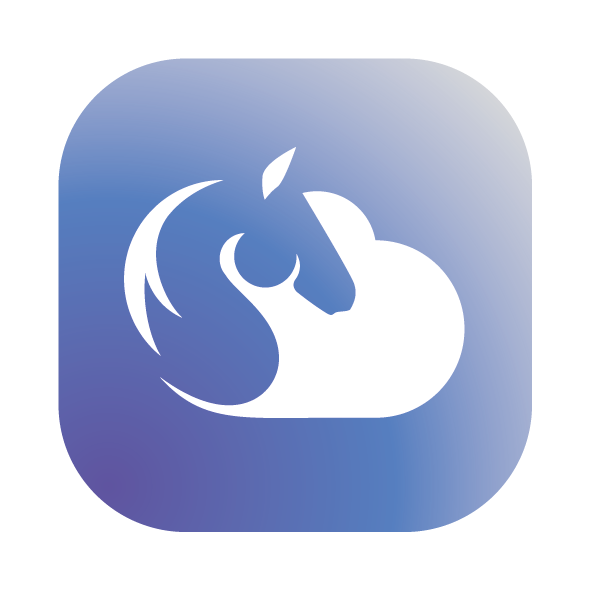
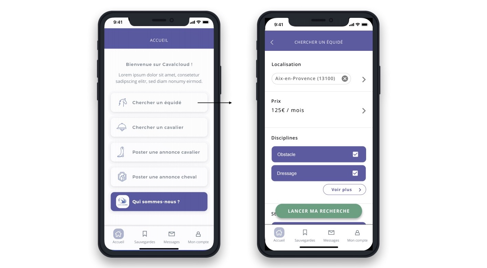

# CavalCloud, la demi-pension simple :racehorse:
### Résumé
CavalCloud est une application web destinée à devenir une Progressiv Web App, elle a donc été pensé en mobile first au vu de son utilisation finale. La cliente a imaginé une plateforme de location de chevaux entre particuliers et propriétaires afin d’améliorer le lien entre eux. CavalCloud est basée, à l’image de la très connue application « Air bnb », sur des critères de géolocalisation et d’autres filtres de correspondances selon les utilisateurs.
Mathilde Hutter, propriétaire et autrice de CavalCloud, nous a fourni une base maquettée par une UX designer ainsi que la charte graphique.
La création s’est déroulée sur React.js pour la partie front-end, et en Node.js pour le back-end. Nous étions une équipé de quatre personnes au départ, et j’ai eu l’envie de travailler aussi bien sur les composants en front, que sur la base de données en back.

:point_right: La plateforme CavalCloud:copyright: c'est par [ici](https://app.cavalcloud.com/) et pour en savoir plus sur le projet de Mathilde Hutter c'est [là](https://sites.google.com/cavalcloud.com/cavalcloud/accueil)

## Stack Techniques

:ledger: JavaScript 
:globe_with_meridians: React.js
:eight_spoked_asterisk: Différents framework & bibliothèques utilisés : 
- Axios
- React-strap & Bootstrap
- JWT-decode

## Compétences :roller_coaster:

## License 
Projet réalisé pour [CavalCloud:copyright:](https://sites.google.com/cavalcloud.com/cavalcloud/accueil) tous droits réservés. 

Ce repo n'est pas celui utilisé aujourd'hui par la marque, c'est une ébauche pour présenter mon code et mes compétences. 

